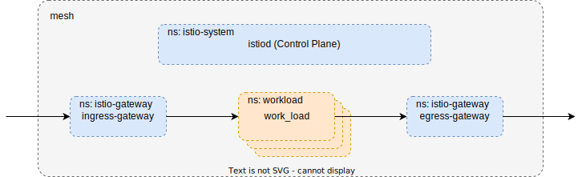

# Istio Installation with IstioOperator



Preparation
===========
```
$
export ISTIO_VERSION=1.14.1
export ISTIO_VERSION_TAG=1.14.1-distroless
export ISTIO_REVISION=1-14-1
```

Create Cluster
===============
```
$ ./00-install-cluster.zsh
```

Install Istiod
==============
```
$ ./01-install-istio.zsh
```

Install Istio-Ingress/Egressgateway
===================================
```
$ ./02-install-gateway.zsh
```

Cleanup
=======
```
$ ./03-cleanup.zsh
```